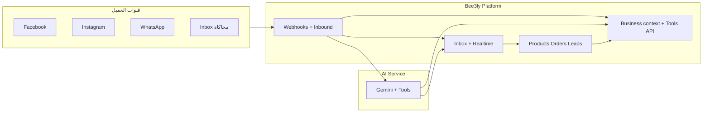

# bee3ly — عرض للمستثمر

**منصة مبيعات اجتماعية بالذكاء الاصطناعي للبيزنسات المصرية**  
الشعار التشغيلي: **من أول رسالة → لأول أوردر**

> آخر مراجعة: مبنية على الكود في `bee3ly-system` (Backend NestJS، Frontend React، AI Python/Gemini).

---

## 1. الرؤية والأهداف

### الرؤية

تمكين أي تاجر مصري (ملابس، مطاعم، عطور، e-commerce…) من **إدارة محادثات العملاء على السوشيال** و**تحويلها لمبيعات** دون فريق دعم كبير — بل وكيل ذكي يفهم العربي والإنجليزي، يعرف المنتجات والشحن، وينشئ الطلبات.

### الأهداف الاستراتيجية (Product goals)

| # | الهدف | لماذا يهم السوق |
|---|--------|------------------|
| 1 | **Unified inbox** — Facebook / Instagram / WhatsApp (و TikTok لاحقًا) في مكان واحد | التاجر اليوم يتنقل بين تطبيقات؛ يضيع leads |
| 2 | **AI sales agent** — ردود، أسعار، مخزون، توصيل، إنشاء أوردر | 80%+ الأسئلة متكررة؛ السرعة = conversion |
| 3 | **Business OS** — منتجات، leads، orders، إشعارات، حملات، تحليلات مرتبطة بالمحادثة | مش مجرد chatbot؛ خط إنتاج مبيعات |
| 4 | **مصر-first** — EGP، محافظات الشحن، أرقام 01x، InstaPay/Vodafone Cash، RTL/AR | منتجات عالمية لا تفهم السياق المحلي |
| 5 | **فصل المنصة عن الدماغ** — Bee3ly = قنوات + بيانات + أدوات؛ AI Service = LLM | قابلية توسع، استبدال نموذج، امتثال |

### الهدف التشغيلي الحالي (MVP slice)

```text
تسجيل → Onboarding → منتجات + معرفة البيزنس → (ربط قناة أو محاكاة)
→ رسالة عميل → AI + أدوات → Lead/Order → إشعار التاجر → مقاييس على الداشبورد
```

هذا المسار **قابل للتجربة end-to-end** اليوم (محاكاة inbox + قنوات Meta عند التفعيل).

---

## 2. المشكلة

1. **فجوة الرد:** رسائل DM وتعليقات بدون رد سريع = خسارة sale.
2. **تشتت القنوات:** FB، IG، WA — كل واحدة inbox منفصل.
3. **تكرار الأسئلة:** سعر، مقاس، توصيل، الدفع — يستهلك وقت المالك.
4. **لا ربط بين المحادثة والأوردر:** Excel وWhatsApp manual.
5. **حملات بدون attribution:** صعب يعرف أي إعلان جاب الطلب.

---

## 3. الحل (bee3ly)



**bee3ly ليست «نموذج لغة داخل السيرفر» فقط** — هي:

- تخزين بيانات التاجر (منتجات، شحن، FAQs، ساعات، دفع).
- استقبال الرسائل، idempotency، توقيع webhooks.
- إصدار JWT للتاجر للـ AI Service.
- تنفيذ **أدوات حقيقية**: `checkStock`, `createOrder`, `getDeliveryInfo`, …
- UI للتاجر: inbox، orders، campaigns، settings.

---

## 4. ما تم تحقيقه فعليًا (Product status)

رموز: ✅ جاهز · 🟡 جزئي/تجريبي · ⏳ مخطط

### 4.1 تجربة التاجر (Frontend)

| الميزة | الحالة | ملاحظات |
|--------|--------|---------|
| Landing + Auth (AR/EN, RTL) | ✅ | تسجيل، دخول، نسيت كلمة المرور (dev: بدون إيميل حقيقي) |
| Onboarding wizard | ✅ | نوع بيزنس، أهداف، قنوات |
| Dashboard `/app` | ✅ | مقاييس من `GET /analytics/overview` |
| Inbox | ✅ | محادثات، realtime (Socket.io)، محاكاة رسائل |
| تأكيد تحويل prepaid | ✅ | review screenshot + زر تأكيد للتاجر |
| Products | ✅ | CRUD، variants، attributes حسب نوع البيزنس |
| Orders | ✅ | قائمة، تغيير حالة، تفاصيل |
| Leads | 🟡 | عرض؛ تحديث حالة محدود من UI |
| AI Agent settings | ✅ | تفعيل، هدف، إعدادات الوكيل |
| Settings | ✅ | قنوات، توصيل (shipping zones)، معرفة البيزنس |
| Campaigns | ✅ | إنشاء، توصيات، launch **بمساعدة** / simulated — **ليس** نشر Ads API تلقائي |
| Analytics `/app/analytics` | 🟡 | واجهة غنية؛ **بيانات preview** (ليست كلها من API بعد) |
| Billing / Plans | 🟡 | اختيار tier في DB — **بدون** Stripe أو فرض limits |
| Privacy + Terms | ✅ | `/privacy`, `/terms` (Meta App URLs) |
| Campaigns placeholder | ❌ | **تم** — صفحة كاملة (انظر أعلاه) |

### 4.2 Backend (NestJS + Prisma)

| Module | الحالة | API تقريبي |
|--------|--------|------------|
| Auth + JWT refresh | ✅ | `/auth/*` |
| Businesses / Team model | 🟡 | `/businesses/me` — invites ⏳ |
| Products | ✅ | `/products` |
| Conversations + Messages | ✅ | `/conversations` |
| Orders | ✅ | `/orders` |
| Notifications | ✅ | `/notifications` + realtime |
| AI simulate + agent | ✅ | `/ai/*` — نفس مسار القنوات للمحاكاة |
| Analytics overview | ✅ | `/analytics/overview` + attribution chains |
| Campaigns | ✅ | `/campaigns` |
| Social Meta | 🟡 | OAuth callback، select page، webhooks، WA embedded signup |
| Realtime | ✅ | Socket.io `/realtime` |
| TikTok | ⏳ | enum في DB + [خطة](./tiktok-integration.md) |

### 4.3 الذكاء الاصطناعي

| Layer | الحالة | التفاصيل |
|-------|--------|----------|
| **AI Service** (`ai-services/`) | ✅ | FastAPI، Gemini، tool rounds، session memory (Redis/fallback) |
| **Adapter** في Backend | ✅ | `AI_SERVICE_URL` → `POST /api/v1/chat` + Bearer merchant JWT |
| **Dev fallback** | ✅ | Rules engine عربي/EN إذا لا URL + `AI_ENGINE_DEV_FALLBACK=true` |
| **Prepaid / payment guard** | ✅ | لا `createOrder` قبل تأكيد التاجر على التحويل |
| **Merchant consultant chat** | 🟡 | Endpoint Python جاهز؛ UI منتج محدود |
| OpenAI في Backend | 🟡 | `llm.engine` موجود؛ **المسار الإنتاجي المستهدف = AI Service** |

### 4.4 قنوات Meta (Foundation)

| Capability | الحالة |
|------------|--------|
| Connect demo (تجريبي) | ✅ |
| OAuth + Page selection | ✅ |
| Webhook verify + ingest | ✅ |
| Inbound → AI → outbound pipeline | 🟡 | يعتمد على tokens + إعداد Meta App |
| Comment polling (dev) | 🟡 | `META_COMMENT_POLLING_ENABLED` |
| WhatsApp Embedded Signup | 🟡 | Config + endpoints؛ يحتاج إعداد Partner |
| Disconnect API | ✅ — UI 🟡 |

### 4.5 البنية التحتية

| Item | الحالة |
|------|--------|
| Postgres (Docker compose) | ✅ |
| `npm run dev` من الجذر | ✅ Backend + Frontend + migrations |
| Frontend على Vercel (مذكور في env docs) | 🟡 | يحتاج `VITE_API_URL` للـ API العام |
| AI Service deploy منفصل | ⏳ | تشغيل محلي موثّق |

---

## 5. مسار البيانات: من رسالة إلى أوردر

```text
Webhook / Simulate → InboundMessageService
  → Conversation + Message (CUSTOMER)
  → AiEngineAdapter (+ merchant JWT)
       → [AI Service: Gemini + tools via Bee3ly API]
       → [أو rules fallback محلي]
  → Message (AI) + Order/Lead + Notification
  → Realtime → Inbox UI
```

**مصدر الحقيقة:** منتجات ومخزون وشحن من PostgreSQL — الـ AI **لا يخترع** أسعارًا؛ يستدعي أدوات على DB.  
(تفاصيل: [architecture-modules.md](./architecture-modules.md))

---

## 6. نموذج العمل (حاليًا)

| Plan tier | في الكود | الدفع |
|-----------|----------|-------|
| FREE / STARTER / GROWTH | `Business.plan` | ⏳ لا Stripe؛ لا feature gates |

**القيمة المقترحة للمستقبل:** اشتراك شهري + حدود (محادثات AI، قنوات، seats) — **لم تُنفَّذ بعد**.

---

## 7. مسار ديمو للمستثمر (15–20 دقيقة)

1. **Register** — بيزنس جديد (أو `npm run db:seed:demo` في backend لحساب مليان).
2. **Onboarding** — اختيار نوع (مثلاً Fashion) + هدف «More orders».
3. **Products** — 2–3 منتجات بأسعار ومقاسات/variants.
4. **Settings → Shipping** — محافظة + رسوم.
5. **Settings → Business knowledge** — مواعيد، FAQs، أرقام الدفع.
6. **AI** — تفعيل الوكيل + الهدف.
7. **Inbox → Simulate** — أسئلة سعر/مقاس → طلب → اسم + `010xxxxxxxx`.
8. **Orders + Notification bell** — أوردر جديد.
9. **Campaigns** — إنشاء حملة + launch «بمساعدة» (توضيح: ليس Meta Ads تلقائي).
10. **Dashboard** — مبيعات/leads/conversations من API.

**اختياري (تقني):** تشغيل `ai-services` + `AI_SERVICE_URL` لعرض Gemini بدل rules fallback.

---

## 8. الفجوات والمخاطر (بشفافية)

| # | الفجوة | الأثر |
|---|--------|-------|
| 1 | لا مدفوعات / limits للباقات | لا revenue automation |
| 2 | Meta production hardening | يحتاج App Review، tokens، monitoring |
| 3 | TikTok | مخطط — غير مربوط |
| 4 | Analytics page vs overview | صفحة analytics جزء mock |
| 5 | إيميل reset password | dev-only |
| 6 | Team invites | schema فقط |
| 7 | Mobile sidebar | سايدبار مخفي `< md` بدون drawer |
| 8 | Deploy AI Service + Redis prod | latency + memory sessions |

---

## 9. لماذا now؟ (Investment thesis مختصر)

- **Social commerce** في مصر على FB/IG/WA — التجار يبيعون في DM already.
- **AI** أصبح cheap enough (Gemini) لكن **القيمة في الربط** بالمخزون والشحن والأوردر — وهذا ما بُني.
- **MVP slice شغال** — ليس slide deck فقط؛ كود قابل للتوسع (modules، adapter، external brain).

---

## 10. الخطوات التالية

راجع **[roadmap.md](./roadmap.md)** للأولويات (Soon / Next / Later).

---

## ملحق: Stack

| طبقة | تقنية |
|------|--------|
| Frontend | React, Vite, TypeScript, TanStack Query, Tailwind, Radix/shadcn |
| Backend | NestJS, Prisma, PostgreSQL, JWT, Socket.io |
| AI | Python FastAPI, Google Gemini, Redis (optional) |
| Channels | Meta Graph / Webhooks, WhatsApp Embedded Signup (config) |

**Brand:** Primary `#6366F1` — واجهة AR default + EN.
